# MT5_HalloWorld

## 概要

MQL5言語を学ぶ最初のステップとして、必要最低限の情報に絞って纏めます。

## MT5言語とは？

MetaTrader 5（MT5）の自動取引システム（EA）で使用されるプログラミング言語です。
また、インジケーター（移動平均線やMACD等）が作成できます。
FXやCFD取引が可能です。

## 学習することによるメリット

- 独自に作成したEAやインジケータの販売ができます。（[gogojungle][:gogojungle:]）
- EAやインジケータの作成委託業務があります。（数は少ないです。）
- EAを作成し、自身の資金を投資、投機して取引可能です。

## 免責事項

- 本プロジェクトの再利用はユーザーの独自の判断と責任に基づきます。
  EAのパフォーマンスや結果について、一切の保証をいたしません。

## 本プロジェクトの方針

1. MT5のインストール
2. 環境構築（githubのソース管理等）
3. 設計思想を理解（インジケータとEAで考え方が少し変わります。）
4. インジケータを作成
5. EAを作成
6. EAの収益性の確認

## MT5のインストール

1. [MetaTrader 5][:metatrader5:]にアクセスし、各OSに対応するインストーラーをダウンロードします。
   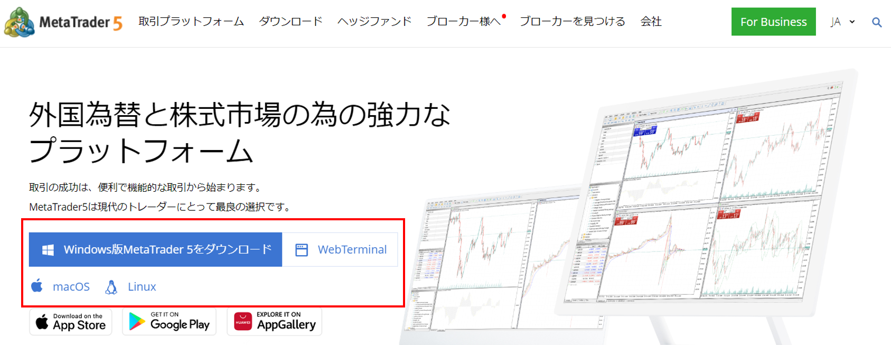

2. ダウンロードしたインストーラーを実行します。インストール完了後に二つのアイコンが作成されます。
   1. 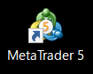 はメインアプリのアイコンです。
   2. 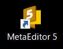 はMQLのIDEアイコンです。

## 環境構築

1. create-symlinks.batのユーザー名を適宜修正（set user=[deltine]）
   ※ ユーザー名のフォルダがメインフォルダとして作成されるので注意してください。
   ※ ファイルのインクルードパスに影響します。

2. create-symlinks.batを実行
   ソースの配置場所にシンボリックリンを作成し、プロジェクトと紐づけを行います。
   ※ 要するにIDEでソースが確認できて、gitの操作もできる様になります。

3. IDEでのソースの見え方
   下図の様に、Experts（EA置き場）や、Indicators（インジケータ置き場）フォルダに作業フォルダが作成されます。
   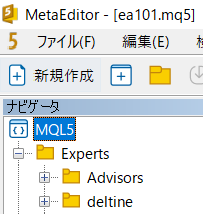

4. vscode（git）でのソースの見え方
   下図の様に、シンボリックリンの参照元フォルダが一覧で表示されます。
   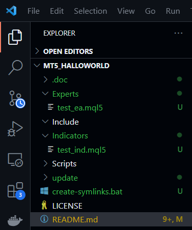

## 設計思想を理解

- アーキテクチャ
  下図の通り色々できます。
  要約：EA等が作成、テスト、配信が可能。ユーザが作成したEAの購入等が可能
  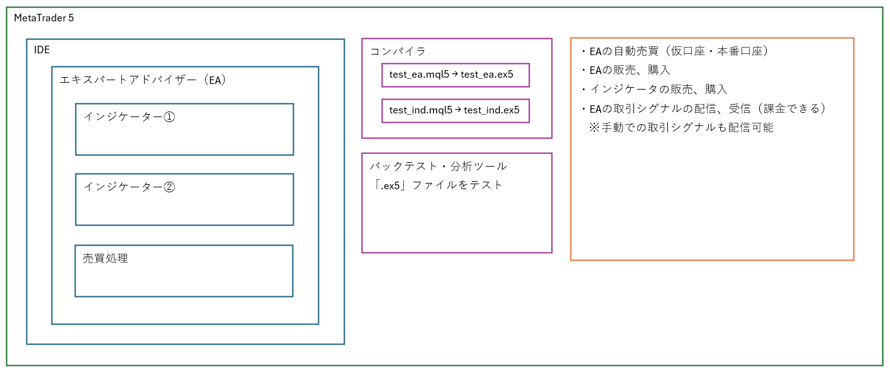

- インジケータ、EAの基本設計
  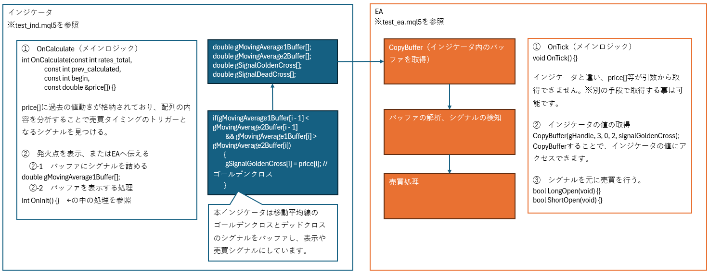

## インジケータを作成

/Indicators/test_ind.mql5 を参照
※ソースにコメントを多数記載しています。

### インジケータの作成方法

1. IDEを開く
    を押下
2. フォルダ等を右クリックでファイルの新規作成
   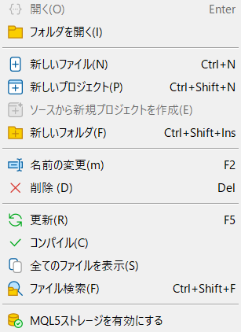
3. または、ナビゲータにソースがある事を確認。
   ファイル名を押下し、編集。
   下図のIDE左側に表示されている。※表示が無い場合は表示メニュー内を確認
   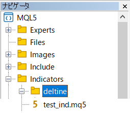

### EAの作成方法

/Experts/test_ea.mql5 を参照
※ソースにコメントを多数記載しています。

作成方法はインジケータと同様

1. IDEを開く
2. フォルダ等を右クリックでファイルの新規作成
3. または、ナビゲータにソースがある事を確認。
   ファイル名を押下し、編集。

### インジケータ・EAの動作確認方法

1. ツールバーのコンパイルボタンでコンパイルを実行
2. 青いスタートボタン（ctrl+F5）でデバッグ開始

### EAのバックテスト(高速)方法

1. メインアプリのストラテジーテスターにEAの設定を行う。
2. チャート、指標、取引を表示するビジュアルモードのチェックを外す
3. 右下のスタートボタン押下
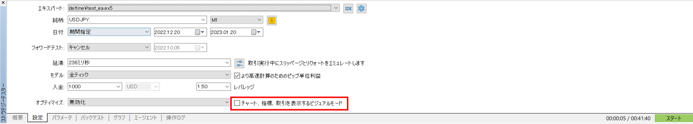

## EAの収益性の確認

参考ソースの実行結果を添付します。

※本件のテストデータは短期的に利益が出るような設定をしています。
長期的なテストを行うと損益が出ています。
騙されない様にご注意ください。

- 売買履歴のグラフ
  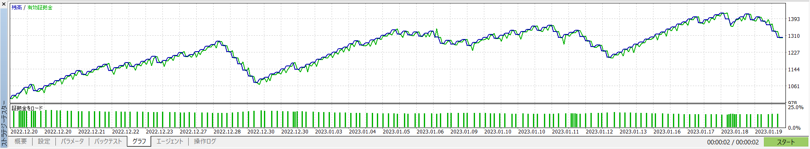

- 詳細な情報
  重要な指標として、プロフィットファクター（PF）とリカバリーファクター（RF）が高いことが望ましいです。
  

[:metatrader5:]:        https://www.metatrader5.com/
[:gogojungle:]:         https://www.gogojungle.co.jp/
